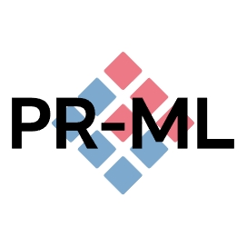

# PR-ML

南京理工大学《模式识别与大数据分析技术》课程（任课教师：孙延凯）代码仓库。参考用书《模式识别-模式识别与机器学习（第四版）》 (张学工 汪小我著)。

<!-- PROJECT SHIELDS -->

[![Contributors][contributors-shield]][contributors-url]
[![Forks][forks-shield]][forks-url]
[![Stargazers][stars-shield]][stars-url]
[![Issues][issues-shield]][issues-url]
[![MIT License][license-shield]][license-url]
[![LinkedIn][linkedin-shield]][linkedin-url]

<!-- PROJECT LOGO -->
 

  
  <h3 align="center">PR-ML</h3>
  

    Pattern Recognition and Machine Learning. 
    <a href="https://github.com/7emotions/PR-ML"><strong>探索本项目的文档 »</strong></a> 
     
    <a href="https://github.com/7emotions/PR-ML/releases">查看发布</a>
    ·
    <a href="https://github.com/7emotions/PR-ML/issues">报告Bug</a>
    ·
    <a href="https://github.com/7emotions/PR-ML/issues">提出新特性</a>
  

## 目录

- [简介](#简介)
- [内容](#内容)
  - [K 均值聚类算法](#k-均值聚类算法)
- [贡献者](#贡献者)
  - [如何参与开源项目](#如何参与该项目)
- [版本控制](#版本控制)
- [作者](#作者)
- [鸣谢](#鸣谢)

### 简介

南京理工大学开设的《模式识别与大数据分析技术》课程中学习的算法笔记与代码实现参考。

### 内容

#### [K 均值聚类算法](k_mean_cluster/doc.md)

### 贡献者。

#### 如何参与该项目

贡献使开源社区成为一个学习、激励和创造的绝佳场所。你所作的任何贡献都是**非常感谢**的。

1. Fork the Project
2. Create your Feature Branch (`git checkout -b feature/AmazingFeature`)
3. Commit your Changes (`git commit -m 'Add some AmazingFeature'`)
4. Push to the Branch (`git push origin feature/AmazingFeature`)
5. Open a Pull Request

### 版本控制

该项目使用Git进行版本管理。您可以在[Releases](https://github.com/7emotions/PR-ML/releases)参看当前可用发布。

### 作者

Lorenzo Feng(lorenzo.feng@njust.edu.cn)

QQ: 3393103594  &ensp; Telegram: @lorenzofeng    

 *您也可以在贡献者名单中参看所有参与该项目的开发者。*

### 版权说明

该项目签署了MIT 授权许可，详情请参阅 [LICENSE](https://github.com/7emotions/PR-ML/blob/master/LICENSE)

### 鸣谢

<!-- links -->
[your-project-path]:7emotions/PR-ML
[contributors-shield]: https://img.shields.io/github/contributors/7emotions/PR-ML.svg?style=flat-square
[contributors-url]: https://github.com/7emotions/PR-ML/graphs/contributors
[forks-shield]: https://img.shields.io/github/forks/7emotions/PR-ML.svg?style=flat-square
[forks-url]: https://github.com/7emotions/PR-ML/network/members
[stars-shield]: https://img.shields.io/github/stars/7emotions/PR-ML.svg?style=flat-square
[stars-url]: https://github.com/7emotions/PR-ML/stargazers
[issues-shield]: https://img.shields.io/github/issues/7emotions/PR-ML.svg?style=flat-square
[issues-url]: https://img.shields.io/github/issues/7emotions/PR-ML.svg
[license-shield]: https://img.shields.io/github/license/7emotions/PR-ML.svg?style=flat-square
[license-url]: https://github.com/7emotions/PR-ML/blob/master/LICENSE.txt
[linkedin-shield]: https://img.shields.io/badge/-LinkedIn-black.svg?style=flat-square&logo=linkedin&colorB=555
[linkedin-url]: https://linkedin.com/in/7emotions

