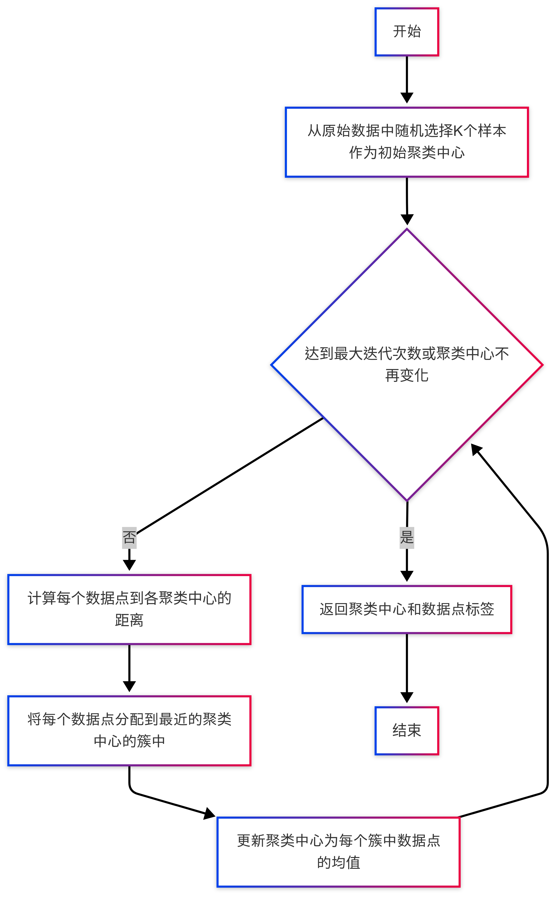
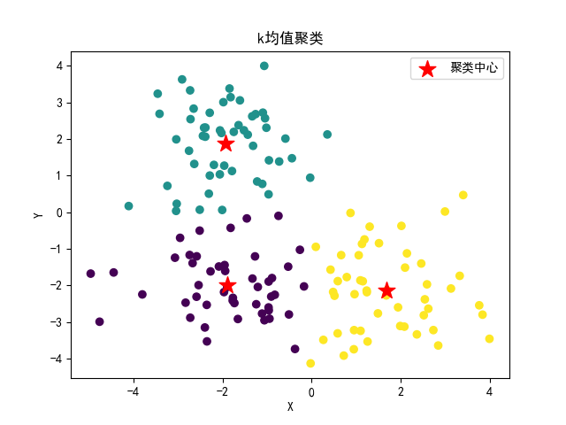

# K 均值算法

## 1. K 均值算法简介
K 均值算法是一种无监督的聚类算法，用于将数据集划分为 K 个簇。算法的目标是将相似的样本划分到同一个簇中，使得每个簇内部的样本尽可能相似，而不同簇之间的样本尽可能不同。

## 2. K 均值算法原理
K 均值算法的基本原理如下：
1. 随机选择 K 个样本作为初始的聚类中心。
2. 计算每个样本与聚类中心的距离，并将样本划分到距离最近的聚类中心所在的簇中。
3. 更新聚类中心为每个簇中样本的均值。
4. 重复步骤 2 和步骤 3，直到聚类中心不再发生变化或者达到预设的迭代次数。

## 3. K 均值算法实现效果

[//]: # (表格)

| 聚类      |            A类             |            B类            |            C类             |
|---------|:-------------------------:|:------------------------:|:-------------------------:|
| 聚类中心    | (-1.89417577,-1.99390585) | (-1.92918627, 1.8886773) | (1.68841018, -2.14660025) |
| 样本点个数统计 |            48             |            52            |            50             |

